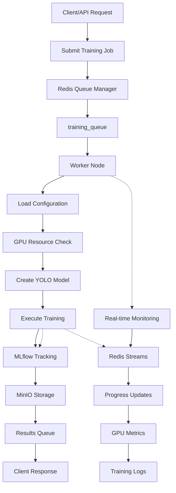
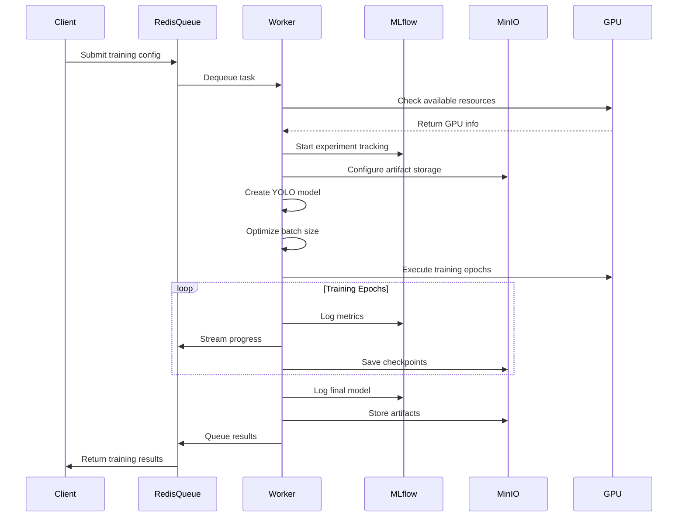
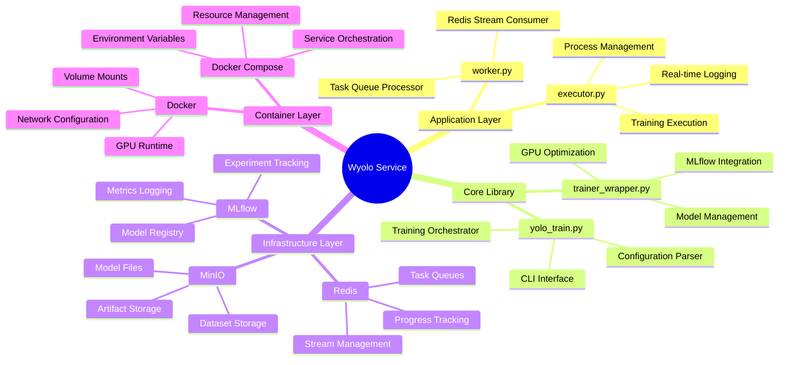

# 🚀 Wyolo Service Worker


**Professional YOLO Training Service with MLOps Integration**

A comprehensive, production-ready YOLO training service that combines the power of Ultralytics YOLO models with advanced MLOps capabilities including MLflow tracking, Redis queue management, and distributed training support.

---

## 📋 Project Overview

Wyolo Service Worker is a sophisticated machine learning training platform designed for enterprise-scale computer vision projects. It provides a robust infrastructure for training YOLO (You Only Look Once) and RT-DETR models with comprehensive experiment tracking, distributed processing, and automated hyperparameter optimization.

### 🎯 Key Features

- **🤖 Multi-Model Support**: YOLO v8, YOLO v9, and RT-DETR model training
- **📊 MLOps Integration**: Full MLflow experiment tracking with MinIO artifact storage
- **⚡ Distributed Processing**: Redis-based task queue system for scalable training
- **🔧 Hyperparameter Optimization**: Optuna-based automated hyperparameter tuning
- **📈 Real-time Monitoring**: GPU utilization tracking and training progress monitoring
- **🐳 Containerized Deployment**: Docker-based deployment with GPU support
- **🔄 Auto-batch Optimization**: Intelligent batch size calculation based on GPU memory
- **📝 Comprehensive Logging**: Structured logging with Loguru and Redis stream management

---

## 🚶 Diagram Walkthrough



### Process Flow Overview

1. **Job Submission**: Client submits training configuration through API or CLI
2. **Queue Management**: Redis queues manage training tasks and results distribution  
3. **Worker Processing**: Worker nodes consume tasks, execute training with GPU optimization
4. **Real-time Monitoring**: Redis streams provide live training progress and logs
5. **Experiment Tracking**: MLflow tracks all training runs, parameters, and metrics
6. **Artifact Storage**: MinIO S3-compatible storage handles model files and datasets
7. **Result Distribution**: Completed training results are queued back to clients

---

## 🗺️ System Workflow



---

## 🏗️ Architecture Components



---

## ⚙️ Container Lifecycle

### Build Process

1. **Base Image**: Uses `wisrovi/agents:gpu-slim-yolo` as foundation
2. **System Dependencies**: Installs GPU libraries, network tools, and CIFS utilities
3. **Directory Structure**: Creates mount points for `/config_versions`, `/database`, `/datasets`
4. **Python Environment**: Installs requirements from `docker/requirements.txt`
5. **Library Installation**: Builds and installs the Wyolo library in editable mode
6. **Script Configuration**: Sets up mount scripts and training service aliases
7. **Network Configuration**: Exposes port 8000 for API access

### Runtime Process

1. **Container Startup**: Initializes with `mount-cifs.sh` execution
2. **Network Storage**: Mounts CIFS shares for datasets and configurations
3. **Environment Setup**: Configures MLflow, MinIO, and Redis connections
4. **Worker Initialization**: Starts Redis stream consumer
5. **GPU Detection**: Identifies and validates GPU resources
6. **Queue Processing**: Begins listening for training tasks
7. **Training Execution**: Processes jobs with real-time monitoring
8. **Resource Cleanup**: Manages temporary files and logs

---

## 📂 File-by-File Guide

| File/Directory | Purpose |
|---------------|---------|
| `app/application/worker.py` | Redis queue consumer that processes training tasks |
| `app/application/executor.py` | Training execution handler with subprocess management |
| `app/lib/src/wyolo/core/trainer_wrapper.py` | Main training engine with MLflow and GPU integration |
| `app/lib/src/wyolo/core/yolo_train.py` | CLI interface for training configuration and execution |
| `app/docker/requirements.txt` | Python dependencies for the container environment |
| `app/docker/mount-cifs.sh` | Network storage mounting script for shared datasets |
| `app/docker/train_service.sh` | Training service launcher with configuration handling |
| `app/Dockerfile` | Container definition with GPU support and dependencies |
| `app/config.yaml` | Default configuration for MLflow, Redis, and training parameters |
| `docker-compose.yaml` | Service orchestration with GPU resource management |
| `start_environment.sh` | Development environment startup script |
| `control_host.env` | Infrastructure configuration variables |
| `user.env` | User-specific authentication and training settings |

---

## 🚀 Getting Started

### Prerequisites

- **Docker & Docker Compose** (v20.10+)
- **NVIDIA Docker Runtime** (for GPU support)
- **Python 3.8+** (for local development)
- **NVIDIA GPU** with CUDA support (recommended)

### Quick Installation

1. **Clone the repository**
   ```bash
   git clone https://github.com/wisrovi/wyoloservice2_worker.git
   cd wyoloservice2_worker
   ```

2. **Environment Configuration**
   ```bash
   # Copy and configure environment files
   cp control_host.env.example control_host.env
   cp user.env.example user.env
   
   # Edit the files with your specific configuration
   nano control_host.env
   nano user.env
   ```

3. **Start the Service**
   ```bash
   # Using Docker Compose (recommended)
   docker-compose up -d
   
   # Or using the provided script
   ./start_environment.sh
   ```

4. **Verify Installation**
   ```bash
   # Check if the worker is running
   docker-compose ps
   
   # View logs
   docker-compose logs -f worker
   ```

### Local Development Setup

```bash
# Navigate to the app directory
cd app

# Install dependencies
pip install -e lib/

# Run tests
cd lib && pytest

# Start worker locally
python application/worker.py
```

---

## 📁 File Structure

```
wyoloservice2_worker/
├── 📁 app/                          # Main application directory
│   ├── 📁 application/              # Core application logic
│   │   ├── 📄 executor.py          # Training execution handler
│   │   └── 📄 worker.py            # Redis queue worker
│   ├── 📁 docker/                   # Docker-related files
│   │   ├── 📄 mount-cifs.sh        # Network storage mounting script
│   │   ├── 📄 requirements.txt     # Python dependencies
│   │   └── 📄 train_service.sh     # Training service launcher
│   ├── 📁 lib/                      # Wyolo library package
│   │   ├── 📁 src/wyolo/           # Core library code
│   │   │   ├── 📁 core/            # Training core modules
│   │   │   │   ├── 📄 trainer_wrapper.py  # Main trainer class
│   │   │   │   └── 📄 yolo_train.py        # CLI training interface
│   │   │   └── 📄 __init__.py
│   │   ├── 📁 examples/            # Usage examples
│   │   │   ├── 📄 basic_training.py
│   │   │   └── 📄 config_example.yaml
│   │   ├── 📁 tests/               # Test suite
│   │   └── 📄 pyproject.toml       # Package configuration
│   ├── 📄 Dockerfile               # Container definition
│   └── 📄 config.yaml              # Default configuration
├── 📄 docker-compose.yaml          # Orchestration configuration
├── 📄 control_host.env             # Control host environment variables
├── 📄 user.env                     # User-specific environment variables
├── 📄 start_environment.sh         # Environment startup script
└── 📄 README.md                    # This documentation
```

### Directory Explanations

- **`app/application/`**: Core worker and executor logic for handling training tasks
- **`app/lib/src/wyolo/core/`**: Main training engine with MLflow integration
- **`app/lib/examples/`**: Sample configurations and usage patterns
- **`app/docker/`**: Container setup and dependency management

---

## ⚙️ Configuration

### Required Configuration Files

#### 1. Environment Variables

**`control_host.env`** - Infrastructure configuration:
```env
# Service endpoints
MLFLOW_TRACKING_URI=http://localhost:23435
MINIO_ENDPOINT=http://localhost:23444
REDIS_HOST=localhost
REDIS_PORT=23438

# Resource limits
WORKER_CPU_CORES=4
WORKER_RAM_MEMORY=8G
MAX_GPU=60
```

**`user.env`** - User-specific settings:
```env
# Authentication
MINIO_ID=your_minio_id
MINIO_SECRET_KEY=your_secret_key
REDIS_PASSWORD=your_redis_password

# Training defaults
DEFAULT_EPOCHS=100
DEFAULT_BATCH_SIZE=16
```

#### 2. Training Configuration

**`config.yaml`** - Main training configuration:
```yaml
# Model configuration
model: "yolov8n.pt"
type: "yolo"
task_id: "training_session_001"

# Training parameters
train:
  data: "/path/to/dataset.yaml"
  epochs: 100
  imgsz: 640
  batch: -1  # Auto-optimize
  verbose: true
  plots: true

# MLOps configuration
mlflow:
  MLFLOW_TRACKING_URI: "http://localhost:5000"
minio:
  MINIO_ENDPOINT: "http://localhost:9000"
  MINIO_ID: "mlflow"
  MINIO_SECRET_KEY: "password"

# Redis queue configuration
redis:
  REDIS_HOST: "localhost"
  REDIS_PORT: 6379
  REDIS_DB: 0
  TOPIC: "training_queue"

# Hyperparameter optimization
sweeper:
  study_name: "yolo_optimization"
  n_trials: 10
  tune: false
  grace_period: 5
```

### Dataset Configuration

Create a dataset configuration file (e.g., `dataset.yaml`):

```yaml
# For object detection
path: /path/to/dataset
train: images/train
val: images/val
test: images/test

nc: 80  # Number of classes
names: ['person', 'bicycle', 'car', ...]  # Class names

# For classification
path: /path/to/dataset
train: train
val: val
test: test

names: ['class1', 'class2', 'class3']
```

---

## 🎯 Usage Examples

### 1. Basic Training via CLI

```bash
# Direct training execution
wyolo-train --config_path=config.yaml --trial_number=1 --fitness=fitness

# Or using Python directly
python -m wyolo.core.yolo_train --config_path=config.yaml --trial_number=1
```

### 2. Programmatic Training

```python
from wyolo import TrainerWrapper

# Configuration
config = {
    "model": "yolov8n.pt",
    "type": "yolo",
    "task_id": "example_001",
    "train": {
        "data": "/path/to/dataset.yaml",
        "epochs": 50,
        "imgsz": 640,
        "batch": 16
    }
}

# Create and configure trainer
trainer = TrainerWrapper(config)
model = trainer.create_model("yolov8n.pt", "yolo")

# Get optimal batch size
optimal_batch = trainer.get_better_batch(batch_to_use=16)
config["train"]["batch"] = optimal_batch

# Start training
results = trainer.train(config["train"])
print(f"Training completed: {results}")
```

### 3. Queue-based Training

```python
# Submit training job to Redis queue
import yaml
from wredis.streams import RedisStreamManager

# Load configuration
with open("config.yaml", "r") as f:
    config = yaml.safe_load(f)

# Connect to Redis
redis_manager = RedisStreamManager(
    host=config["redis"]["REDIS_HOST"],
    port=config["redis"]["REDIS_PORT"]
)

# Submit training task
redis_manager.add_to_stream(
    key="training_queue",
    data={
        "config_path": "/path/to/config.yaml",
        "trial_number": 1
    }
)
```

### 4. Hyperparameter Optimization

```yaml
# Enable hyperparameter tuning in config.yaml
sweeper:
  study_name: "yolo_hyperopt"
  n_trials: 50
  tune: true
  grace_period: 10
  algorithm: "optuna"
  direction: "maximize"
  sampler: "TPESampler"
```

### 5. GPU Monitoring and Control

```python
# Monitor GPU usage during training
from wyolo.core.trainer_wrapper import obtener_info_gpu_json

gpu_info = obtener_info_gpu_json()
for gpu in gpu_info:
    print(f"GPU {gpu['gpu_0_name']}: {gpu['gpu_0_load']:.1f}% load, "
          f"{gpu['gpu_0_memoryFree']}MB free")
```

---

## 🔄 System Workflow Diagram

```
┌─────────────────┐    ┌──────────────────┐    ┌─────────────────┐
│   Client/API    │    │   Redis Queue    │    │  Worker Node    │
│                 │    │                  │    │                 │
│  Submit Job     │───▶│  training_queue  │───▶│  Process Task   │
│  Config File    │    │  results_queue   │    │  Execute Train  │
│                 │    │                  │    │                 │
└─────────────────┘    └──────────────────┘    └─────────────────┘
         │                       │                       │
         │                       │                       │
         ▼                       ▼                       ▼
┌─────────────────┐    ┌──────────────────┐    ┌─────────────────┐
│   MLflow UI     │    │  Redis Streams   │    │   MinIO S3      │
│                 │    │                  │    │                 │
│  Track Runs     │    │  Real-time Logs  │    │  Store Models   │
│  Compare Models │    │  Progress Updates │    │  Artifacts      │
│                 │    │                  │    │                 │
└─────────────────┘    └──────────────────┘    └─────────────────┘
```

### Diagram Walkthrough

1. **Job Submission**: Client submits training configuration through API or CLI
2. **Queue Management**: Redis queues manage training tasks and results distribution
3. **Worker Processing**: Worker nodes consume tasks, execute training with GPU optimization
4. **Real-time Monitoring**: Redis streams provide live training progress and logs
5. **Experiment Tracking**: MLflow tracks all training runs, parameters, and metrics
6. **Artifact Storage**: MinIO S3-compatible storage handles model files and datasets
7. **Result Distribution**: Completed training results are queued back to clients

---

## 🔧 Advanced Features

### GPU Optimization

The system automatically optimizes GPU usage:

```python
# Automatic batch size optimization
trainer = TrainerWrapper(config)
optimal_batch = trainer.get_better_batch(batch_to_use=32)
# Returns optimal batch size based on available GPU memory
```

### Training Control

```bash
# Stop training remotely
touch /config/stop_training_{task_id}.txt

# Monitor training progress
redis-cli HGETALL "progress:{task_id}"
```

### Model Registry Integration

```python
# Models are automatically registered in MLflow
# Access via:
# mlflow ui --port 5000
# http://localhost:5000
```

---

## 🧪 Testing

```bash
# Run all tests
cd app/lib && pytest

# Run with coverage
pytest --cov=wyolo --cov-report=html

# Run specific test categories
pytest -m "not slow"  # Skip slow tests
pytest -m integration  # Run integration tests only
```

---

## 📊 Monitoring and Logging

### Real-time Progress Tracking

- **Redis Streams**: Live training logs and metrics
- **MLflow Dashboard**: Comprehensive experiment tracking
- **GPU Monitoring**: Real-time GPU utilization and memory usage

### Log Levels

```python
# Configure logging in config.yaml
logging:
  level: "INFO"  # DEBUG, INFO, WARNING, ERROR
  format: "detailed"  # simple, detailed, json
```

---

## 🚀 Deployment

### Production Deployment

```bash
# Deploy with GPU support
docker-compose -f docker-compose.yaml up -d

# Scale workers
docker-compose up -d --scale worker=3

# Monitor deployment
docker-compose logs -f
```

### Environment Variables for Production

```env
# Security
MINIO_SECRET_KEY=your_secure_key
REDIS_PASSWORD=your_redis_password

# Performance
WORKER_CPU_CORES=8
WORKER_RAM_MEMORY=16G
MAX_GPU=80

# Monitoring
MLFLOW_TRACKING_URI=https://mlflow.company.com
MINIO_ENDPOINT=https://minio.company.com
```

---

## 🤝 Contributing

1. Fork the repository
2. Create a feature branch: `git checkout -b feature/amazing-feature`
3. Commit changes: `git commit -m 'Add amazing feature'`
4. Push to branch: `git push origin feature/amazing-feature`
5. Open a Pull Request

### Development Guidelines

- Follow PEP 8 style guidelines
- Add tests for new features
- Update documentation
- Use type hints for all functions

---

## 📄 License

This project is licensed under the MIT License - see the [LICENSE](LICENSE) file for details.

---

## 🆘 Support

- **Documentation**: [https://wyolo.readthedocs.io/](https://wyolo.readthedocs.io/)
- **Issues**: [GitHub Issues](https://github.com/wisrovi/wyoloservice2_worker/issues)
- **Discussions**: [GitHub Discussions](https://github.com/wisrovi/wyoloservice2_worker/discussions)

---

## 🙏 Acknowledgments

- **Ultralytics**: For the amazing YOLO implementation
- **MLflow**: For experiment tracking infrastructure
- **Optuna**: For hyperparameter optimization
- **Redis**: For high-performance queue management
- **MinIO**: For S3-compatible object storage

---

**Built with ❤️ by [William Steve Rodriguez Villamizar](https://github.com/wisrovi)**