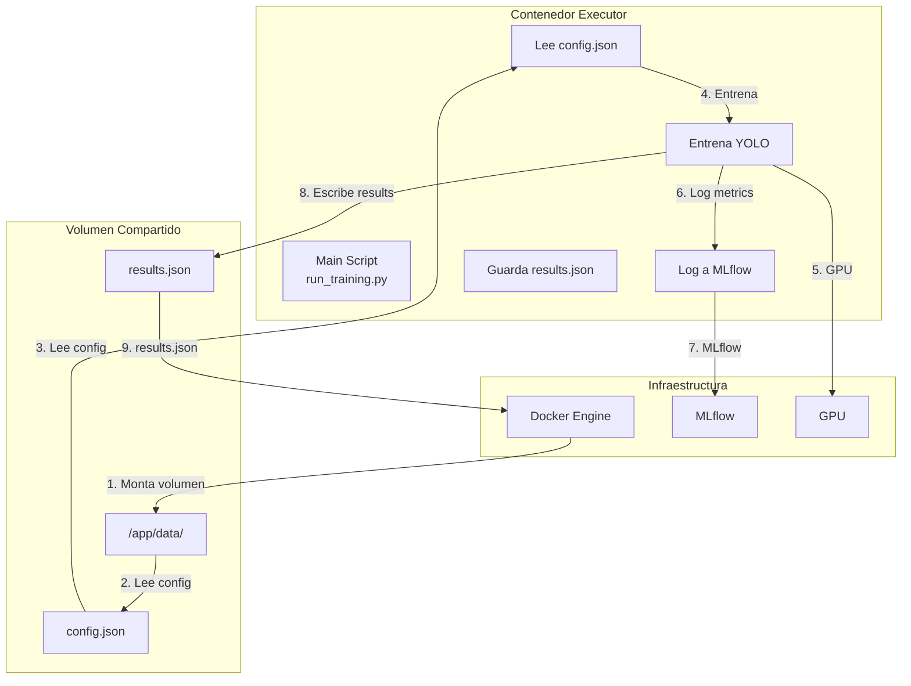
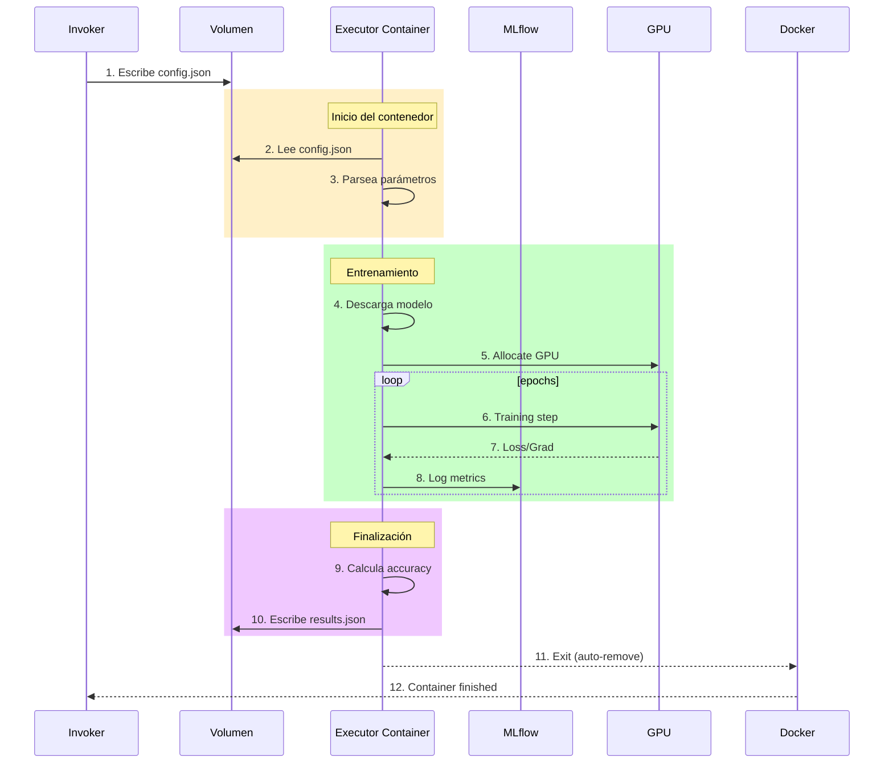
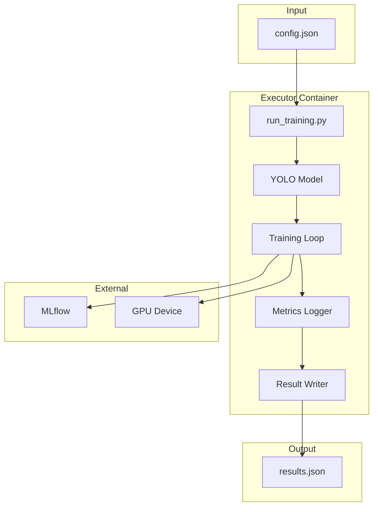

# Worker Executor - YOLO Training Container

Este componente es el **contenedor efímero** donde se ejecuta el entrenamiento real del modelo YOLO. Es lanzado por el Invoker mediante Docker, ejecuta el entrenamiento, y retorna métricas.

---

## 1. 🚶 Diagram Walkthrough


```mermaid
flowchart TD
    subgraph "Contenedor Executor"
        M[Main Script<br/>run_training.py]
        C[Lee config.json]
        T[Entrena YOLO]
        L[Log a MLflow]
        S[Guarda results.json]
    end

    subgraph "Volumen Compartido"
        V["/app/data/"]
        VC[config.json]
        VR[results.json]
    end

    subgraph "Infraestructura"
        D[Docker Engine]
        ML[MLflow]
        GPU[GPU]
    end

    D -->|1. Monta volumen| V
    V -->|2. Lee config| VC
    VC -->|3. Lee config| C
    C -->|4. Entrena| T
    T -->|5. GPU| GPU
    T -->|6. Log metrics| L
    L -->|7. MLflow| ML
    T -->|8. Escribe results| VR
    VR -->|9. results.json| D
```

**Flujo Principal:**
1. Invoker monta volumen temporal en /app/data
2. Executor lee config.json con parámetros
3. Descarga modelo YOLO base
4. Ejecuta entrenamiento con parámetros del trial
5. Envía métricas a MLflow
6. Guarda results.json con accuracy
7. Contenedor termina y se elimina automáticamente

---

## 2. 🗺️ System Workflow


```mermaid
sequenceDiagram
    participant I as Invoker
    participant V as Volumen
    participant E as Executor Container
    participant ML as MLflow
    participant GPU as GPU
    participant D as Docker

    I->>V: 1. Escribe config.json
    
    rect rgb(255, 240, 200)
        note over E: Inicio del contenedor
        E->>V: 2. Lee config.json
        E->>E: 3. Parsea parámetros
    end
    
    rect rgb(200, 255, 200)
        note over E: Entrenamiento
        E->>E: 4. Descarga modelo
        E->>GPU: 5. Allocate GPU
        loop epochs
            E->>GPU: 6. Training step
            GPU-->>E: 7. Loss/Grad
            E->>ML: 8. Log metrics
        end
    end
    
    rect rgb(240, 200, 255)
        note over E: Finalización
        E->>E: 9. Calcula accuracy
        E->>V: 10. Escribe results.json
    end
    
    E-->>D: 11. Exit (auto-remove)
    D-->>I: 12. Container finished
```

---

## 3. 🏗️ Architecture Components


```mermaid
graph TB
    subgraph "Executor Container"
        R[run_training.py]
        Y[YOLO Model]
        T[Training Loop]
        M[Metrics Logger]
        W[Result Writer]
    end

    subgraph "Input"
        CF[config.json]
    end

    subgraph "Output"
        RF[results.json]
    end

    subgraph "External"
        ML[MLflow]
        GP[GPU Device]
    end

    CF --> R
    R --> Y
    Y --> T
    T --> GP
    T --> ML
    T --> M
    M --> W
    W --> RF
```

### Componentes Clave

| Componente | Descripción |
|------------|-------------|
| **run_training.py** | Script principal del contenedor |
| **YOLO Model** | Modelo base (yolov8, yolo11, etc.) |
| **Training Loop** | Bucle de entrenamiento epochs |
| **Metrics Logger** | Envío de métricas a MLflow |
| **Result Writer** | Escritura de results.json |

---

## 4. ⚙️ Container Lifecycle

### Build Process

1. **Base Image**: Python + CUDA + Ultralytics
2. **Dependencies**: Instala `ultralytics`, `mlflow`, `pyyaml`
3. **Code Copy**: Copia run_training.py
4. **Workdir**: Configura /app como directorio de trabajo
5. **Entrypoint**: Ejecuta run_training.py

### Runtime Process

1. **Read Config**: Lee /app/data/config.json
2. **Parse Parameters**: Extrae lr0, imgsz, epochs, etc.
3. **Model Load**: Descarga modelo base de Ultralytics
4. **Training**: Ejecuta entrenamiento con parámetros
5. **Metrics**: Log a MLflow durante entrenamiento
6. **Results**: Calcula accuracy final
7. **Write Output**: Guarda /app/data/results.json
8. **Exit**: Contenedor termina y Docker lo elimina

---

## 5. 📂 File-by-File Guide

| Archivo/Carpeta | Propósito |
|-----------------|-----------|
| `executor/run_training.py` | Script principal de entrenamiento |
| `executor/requirements.txt` | Dependencias Python |
| `executor/Dockerfile` | Imagen del contenedor |
| `executor_v2.0/wyolo_mother/` | Versión avanzada con MLflow real |

---

## Configuración de Entrenamiento

```yaml
# config.json (entregado por Invoker)
model: "yolov8n-cls.pt"
train:
  data: /dataset/
  epochs: 250
  imgsz: 640
  lr0: 0.01
sweeper:
  study_name: "mi_estudio"
```

### Resultados

```json
// results.json (escrito por Executor)
{
  "status": "success",
  "accuracy": 0.85,
  "study_name": "mi_estudio"
}
```

---

## Construcción

```bash
cd wyoloservice2_worker/executor
docker build -t wisrovi/train_service:worker_executor_v1.0.0 .
```

---

**William R.** - AI Leader & Solutions Architect
