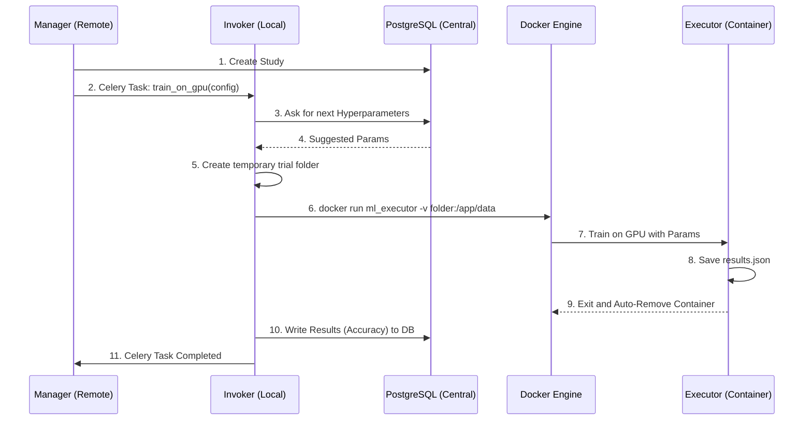

# Portable Worker - GPU Training Unit (Distributed Mode)

This component is an autonomous execution unit designed for **distributed ML optimization**. It uses the **Invoker-Executor** pattern and connects to a centralized **PostgreSQL** database to synchronize Optuna studies across multiple nodes.

## Distributed Architecture (Scenario C)

In this setup, intelligence is decentralized through a central database.

- **Manager (Control Plane):** Creates studies and sends tasks via Celery.
- **Invoker (Worker):** Receives tasks, asks the **PostgreSQL** for the next trial parameters, executes them in an ephemeral container, and reports results directly back to the database.
- **PostgreSQL (Central Brain):** Stores all trials, studies, and hyperparameters. Located at `192.168.10.252:23436`.
- **Redis (Broker):** Manages task distribution between Manager and Workers.
- **Dashboards:** 
    - **Custom Dashboard (Port 8000):** Local/Global monitoring of Celery workers and study summaries.
    - **Optuna Dashboard (Official):** Scientific visualization (should be deployed with the Manager).

## Sequence Flow (Distributed)


```mermaid
sequenceDiagram
    participant M as Manager (Remote)
    participant I as Invoker (Local)
    participant DB as PostgreSQL (Central)
    participant D as Docker Engine
    participant E as Executor (Container)

    M->>DB: 1. Create Study
    M->>I: 2. Celery Task: train_on_gpu(config)
    I->>DB: 3. Ask for next Hyperparameters
    DB-->>I: 4. Suggested Params
    I->>I: 5. Create temporary trial folder
    I->>D: 6. docker run ml_executor -v folder:/app/data
    D->>E: 7. Train on GPU with Params
    E->>E: 8. Save results.json
    E-->>D: 9. Exit and Auto-Remove Container
    I->>DB: 10. Write Results (Accuracy) to DB
    I->>M: 11. Celery Task Completed
```

## Queue and Priority Management

Each worker is configured to listen to multiple queues with a strict priority order.

### Consumption Hierarchy (Strict Priority)
The worker consumes tasks in this order:
1.  **Private Queue (`worker_{NAME}`)**: Highest priority. Reserved for critical tasks or direct assignment.
2.  **`gpus_high`**: High-priority tasks.
3.  **`gpus_medium`**: Standard tasks (default).
4.  **`gpus_low`**: Low-priority / experimental tasks.

### Consumer Configuration
The startup command defines the order:
```bash
celery worker -Q ${PRIVATE_QUEUE},gpus_high,gpus_medium,gpus_low --concurrency=1
```
Using `--concurrency=1` ensures the worker fully completes a task before fetching the next available one from the highest-priority queue.

## Multiple Invokers on Same Machine

You can run multiple Invokers on the same machine, each with its own private queue:

### Creating Invokers

```bash
# Using the launcher script
./launcher_invoker.sh --private_name worker_1
./launcher_invoker.sh --private_name worker_2
./launcher_invoker.sh --private_name gpu_node_alpha
```

Each Invoker gets:
- Its own **private queue** (e.g., `worker_1`)
- Plus the **3 public queues** (`gpus_high`, `gpus_medium`, `gpus_low`)

### Task Distribution

When tasks are sent to a public queue (e.g., `gpus_medium`), Celery distributes them round-robin across all Invokers listening to that queue:

```
┌──────────────┐     ┌──────────────┐     ┌──────────────┐
│  Invoker 1   │     │  Invoker 2   │     │  Invoker 3   │
│ private: w1  │     │ private: w2  │     │ private: w3  │
└──────┬───────┘     └──────┬───────┘     └──────┬───────┘
       │                    │                    │
       ▼                    ▼                    ▼
    ┌─────────────────────────────────────────────┐
    │              gpus_medium queue              │
    │         (Celery round-robin)                │
    │   Task1  Task2  Task3  Task4  Task5  ...  │
    └─────────────────────────────────────────────┘
```

## Executor Naming

Each Executor container is automatically named following the pattern:

```
{private_name}_son_{timestamp}
```

**Examples:**
- `worker_1_son_20260312_143022`
- `worker_2_son_20260312_145501`
- `gpu_node_alpha_son_20260312_151200`

This naming convention allows you to:
- Track which Invoker launched which Executor
- Identify the order of executions
- Debug and monitor resources

The Invoker reads the `PRIVATE_QUEUE` environment variable to determine its naming prefix.

## Portable Deployment

### Quick Start

```bash
# Clone and navigate to worker directory
cd worker

# Create an Invoker with a specific private queue
./launcher_invoker.sh --private_name worker_1
```

### Configuration Options

1. **Environment Variables:**
   - `REDIS_URL`: Central broker URL (default: `redis://redis:6379/0`)
   - `PRIVATE_QUEUE`: Private queue name (default: `worker_default`)

2. **Monitoring & Visibility:**
   - To ensure the worker is visible in **Flower** or the **Custom Dashboard**, do not use `--without-heartbeat` or `--without-gossip` in the startup command.
   - The configuration `worker_send_task_events: True` is enabled in `celery_config.py` to prevent initialization errors during remote monitoring.

3. **Docker Compose:**
   ```bash
   PRIVATE_QUEUE=worker_alpha docker-compose up -d
   ```

### Build Custom Executor

If you need to customize the executor:

```bash
cd worker/executor
docker build -t my-custom-executor:v1.0.0 .
```

Then update `invoker/config.yaml`:

```yaml
worker:
  executor_image: "my-custom-executor:v1.0.0"
```

## Monitoring

Check running containers:
```bash
docker ps | grep worker_
```

View Invoker logs:
```bash
docker logs worker_worker_1
```

View Executor logs (by name):
```bash
docker logs worker_1_son_20260312_143022
```
