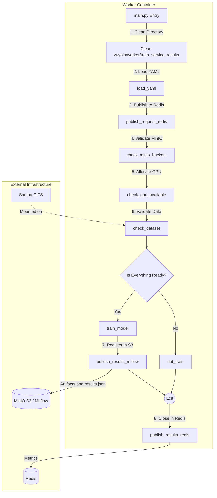

# Worker Executor v2.0 - YOLO Distributed Training Container

This component is the high-performance **ephemeral execution container** where the actual training of YOLO models (classification, detection, and segmentation) is performed. It is launched dynamically by the Invoker, processes configurations through the `wpipe` pipeline engine, and reports results to MLflow, MinIO, and Redis.

---

## 1. 🚶 Process Flowchart (Pipeline Stack)

The Executor runs a sequential pipeline based on the corporate `wpipe` library, ensuring that each intermediate life-cycle step is validated and recorded.


```mermaid
flowchart TD
    subgraph Worker_Container [Worker Container]
        M[main.py Entry] -->|1. Clean Directory| C[Clean /wyolo/worker/train_service_results]
        C -->|2. Load YAML| L[load_yaml]
        L -->|3. Publish to Redis| PR[publish_request_redis]
        PR -->|4. Validate MinIO| MIN[check_minio_buckets]
        MIN -->|5. Allocate GPU| GPU[check_gpu_available]
        GPU -->|6. Validate Data| DS[check_dataset]
        
        DS --> Dec{Is Everything Ready?}
        Dec -->|Yes| T[train_model]
        Dec -->|No| NT[not_train]
        
        T -->|7. Register in S3| PML[publish_results_mlflow]
        PML --> End((Exit))
        NT --> End
        End -->|8. Close in Redis| RED[publish_results_redis]
    end

    subgraph Host_and_Services [External Infrastructure]
        SM[Samba CIFS] -.->|Mounted on| DS
        RED -->|Metrics| R[(Redis)]
        PML -->|Artifacts and results.json| MINIO[(MinIO S3 / MLflow)]
    end
```

---

## 2. 🛡️ Key Features of Version 2.0

*   **YOLO26 Native Support:** Fully validated for classic architectures and the new `yolo26` architectures (e.g., `yolo26n.pt`, `yolo26n-cls.pt`, `yolo26n-seg.pt`).
*   **Absolute Experiment Isolation:** The pipeline entrypoint cleans the host-mounted directories to prevent carryover artifacts from prior runs.
*   **Fuzzy Metrics Extraction:** Robust translation between generic metrics names and task-specific names (e.g. mapping `metrics/mAP50` to `metrics/mAP50(B)` for detection or `metrics/mAP50(M)` for segmentation).
*   **Preventative Samba Check:** Runs write touch tests at startup on `/wyolo/control_server/...` to detect mount issues immediately.

---

## 3. 🏗️ MinIO S3 Artifacts Tree Layout

Upon successful completion, artifacts are streamed to S3 under the following hierarchy:

*   `results.json` (At the root of the run: e.g. `{"accuracy": 0.6635}`).
*   `model_weights/` (`best.pt` and `last.pt`).
*   `evaluation_metrics/` (Confusion matrices, F1/PR curves, CSV logs).
*   `training_examples/` (Batch predictions and control training samples).
*   `validation_examples/` (Batch validation visual outputs).
*   `training_artifacts/` (Copies of the config YAML files).

---

## 4. ⚙️ Configuration Templates

### Input Configuration (`base_config.yaml`)

```yaml
model: "yolo26n.pt"  # or yolo26n-cls.pt, yolo26n-seg.pt
type: "yolo"
train:
  batch: -1
  data: "/examples/Deteksi komponen elektronik.v1i.yolov8/data.yaml"
  epochs: 2
  imgsz: 640
  plots: true
sweeper:
  version: 1
  algorithm: optuna
  direction: maximize
  study_name: "component_detection"
  fitness: "metrics/mAP50"
  tune: false
  sampler: "TPESampler"
  n_trials: 1
  search_space:
    model: [ "choice", "yolov8n.pt" ]
    train:
      imgsz: [ "choice", 416 ]
      lr0: [ "loguniform", 1e-5, 1e-2 ]
extras:
  gpu:
    id: 0
    limit: 0.95
metadata:
  content: "Electronic component detection experiment."
  author: "William Rodriguez"
  documentation: "Model trained using YOLO26 weights."
```

### Output Results (`results.json`)

```json
{
  "accuracy": 0.6635
}
```

---

## 🐳 Building and Deployment

To compile the image locally and include the latest example datasets:

```bash
# Navigate to the wtrain subproject root
cd executor_v2.0/wtrain

# Compile without cache to prevent mount issues
DOCKER_BUILDKIT=0 docker build --no-cache -t wisrovi/train_service:worker_executor_v1.0.0 -f Dockerfile .

# Push image to Docker Hub
docker push wisrovi/train_service:worker_executor_v1.0.0
```

---

## 📜 Changelog & Version History

### Version 2.2.11 (Current Release) - 2026-08-05
*   **LLM Report Generation in Executor:** Added `LlmAnalyzer` step to `pipeline_post_train.set_steps` in `lib/src/wyolo/trainer/post_train.py`. It runs the ported `TrainingReportAnalyzer` (OpenCode with 180s timeout + CSV fallback) on `evaluation_metrics/results.csv` and writes `llm.md` into the shared results directory (`/wyolo/worker/train_service_results`). Because `mlflow.log_artifacts(ARTIFACTS_PATH)` runs after `pipeline_post_train.run` in `on_train_end`, `llm.md` is automatically uploaded to MLflow as an artifact. The invoker no longer calls OpenCode itself — it reads the generated `llm.md` and its Gradio renders it directly.
*   **OpenCode Installed in Executor Image:** Added `curl` and `RUN curl -fsSL https://opencode.ai/install | bash` to the executor Dockerfile so the LLM analysis runs natively inside the executor container.
*   **Version Update to v2.2.11:** Bumped executor version to `v2.2.11`.

### Version 2.2.10 (Current Release) - 2026-08-05
*   **Version Update to v2.2.10:** Bumped executor version to `v2.2.10`.
*   **Host env snapshot refresh:** Updated `config/user.env` with the current worker host date/time snapshot.

### Version 2.2.9 - 2026-08-04
*   **Restore Deleted MLflow Experiments Before Training:** `Mlflow_setup.set_config_vars` now checks the target MLflow experiment by name; if it exists with `lifecycle_stage == "deleted"` it is restored (or created if missing). Previously the ultralytics MLflow callback raised a REST exception on `set_experiment` for deleted experiments (e.g. `color_ball_v2`), which aborted `on_train_end` before `artifacts_organice` could publish `evaluation_metrics/results.csv` and the other artifacts, leaving the invoker's LLM analyzer unable to find the results and flagging the run as `failed`.
*   **Disable Inherited Healthcheck in Executor Image:** Added `HEALTHCHECK NONE` to the executor Dockerfile to override the base image healthcheck (`(opencode --version && nvidia-smi) || exit 1`), which failed because `opencode` is not installed in the container, leaving the executor permanently `unhealthy`.
*   **Version Update to v2.2.9:** Bumped executor version to `v2.2.9`.

### Version 2.2.8 - 2026-08-04
*   **Fix get_base_config Missing /config Directory:** `get_base_config` in `app/states/utils/util.py` now creates the `/config` directory before writing `final_config.yaml`. The `check_minio_buckets` step called `read_base_config` early in the pipeline and crashed with `[Error Code: 502] No such file or directory: '/config/final_config.yaml'` (captured as a pipeline error, leaving the run flagged as `failed` even though training completed and `results.json` was written).
*   **Version Update to v2.2.8:** Bumped executor version to `v2.2.8`.

### Version 2.2.7 - 2026-08-03
*   **Dataset Analyzer Integration:** Embedded `DatasetAnalyzer` directly into `app/states/utils/dataset_analyzer.py` inside the executor container. This allows the invoker's EDA state to run analysis natively via the executor container environment without transferring scripts.

### Version 2.2.6 - 2026-07-31
*   **Support valid/ Dataset Folder & Debug Info:** Integrated support for scanning the `valid/images/` folder (Roboflow notation) and added print statements detailing the number of found images and verification examples.
*   **Exclude results.png Plot:** Added the `"results"` prefix to the image filter to completely ignore training progress graphs like `results.png` or `results.txt`.

### Version 2.2.5 - 2026-07-31
*   **Precision Filtering for YOLO Metric Plots:** Replaced the broad folder keyword filter with a highly specific filename prefix/suffix check (targeting `confusion_matrix`, `curve`, `train_batch`, `val_batch`, `labels.jpg`), ensuring Roboflow dataset images with `val_` or `train_` filename prefixes are processed correctly and uploaded to MLflow.

### Version 2.2.4 - 2026-07-31
*   **Permit Dataset Subfolders in Filter:** Patched the image filter in `post_train.py` to allow image paths containing `train/` and `val/` directories, preventing valid test dataset images from being discarded.

### Version 2.2.3 - 2026-07-31
*   **Filter Training Results Artifacts:** Added advanced filtering in `post_train.py` to exclude training artifacts (confusion matrices, curves, batches) from being processed and drawn with bounding boxes during validation.

### Version 2.2.2 - 2026-07-31
*   **Wipe-out Previous Predictions:** Added automatic folder cleanup for `post_train_results/` using `shutil.rmtree` before executing new trials, preventing prediction outputs from overlapping across runs.
*   **Refactor Pipeline Steps:** Renamed the wpipe step `StepClass` to `PostTrain` for cleaner code naming conventions.
*   **Bump Version:** Bumped version to `2.2.2` in `main.py`.

### Version 2.2.1 - 2026-07-31
*   **Checkpoint Optimization:** Increased `EPOCH_TO_SAVE` limit to 25 epochs to minimize intermediate metric logging and artifact uploads to MLflow during long runs.
*   **Version and Imports Saneation:** Bumped internal version to `2.2.1` in `main.py` and removed unused Tkinter/NumPy imports in `post_train.py`.
*   **Massive Docker Broadcast Pull Command:** Registered a new custom Celery remote control handler (`force_docker_pull`) inside the worker invoker to enable fast, massive cluster-wide image pulling.
*   **AI Agent Workflows Sync:** Added rules in `AGENTS.md` to require AI agents to propose massive node updates using the MCP tool `trigger_broadcast_docker_pull` after any docker image push.

### Version 2.2.0 - 2026-07-31
*   **Robust Preview Predictions:** Patched prediction execution in `post_train.py` and `trainer_wrapper.py` by instantiating the high-level `YOLO` wrapper with final best weights (resolving the missing `.predict()` method error), and recursive image subfolder scanning.
*   **MLflow Artifact Path Correction:** Routed the post-training predictions output directory to `self.ARTIFACTS_PATH`, ensuring that the generated `post_train_results/` preview images are uploaded as runs artifacts.

### Version 2.1.1 - 2026-07-31
*   **Intermediate Checkpoint Optimization:** Optimized MLflow artifact upload intervals in `on_epoch_end`. The trainer now saves and logs metrics only during the first epoch and then at every 10-epoch interval (`EPOCH_TO_SAVE = 10`), reducing runtime bandwidth and disk consumption.

### Version 2.1.0 - 2026-07-31
*   **Post-Train Preview Predictions:** Added a new post-training preview execution step to the pipeline. It reads test images from the dataset and executes YOLO preview predictions, saving outputs to the project temp directory.
*   **Cleaned Imports and Core Bump:** Upgraded the internal version to `v2.1.0` in `main.py` and consolidated trainer imports.

### Version 2.0.0 - 2026-07-03
*   **YOLO26 & /examples/ Re-structuring:** Migrated dataset examples directory from `/examples/clasifier` to clean `/examples` path and updated all 3 training YAML models.
*   **Fuzzy Metrics Matching:** Integrated regex parsing to automatically extract validation metrics (`mAP50(B)` / `mAP50(M)`) for MLflow logs.
*   **Pre-execution Mount Cleanups:** Shifted output directory wipe out to container startup in `main.py` to prevent metrics overlaps.
*   **CIFS Touch Validation Test:** Added hot touch write permissions verification to `/usr/local/bin/mount-cifs.sh`.

### Version 1.0.0 (Initial Release) - 2026-02-10
*   Ephemeral Docker execution layer using YOLOv8 classification.
*   Telemetry tracking with RAM and CPU consumption stats.

---

**William R.** - AI Leader & Solutions Architect
