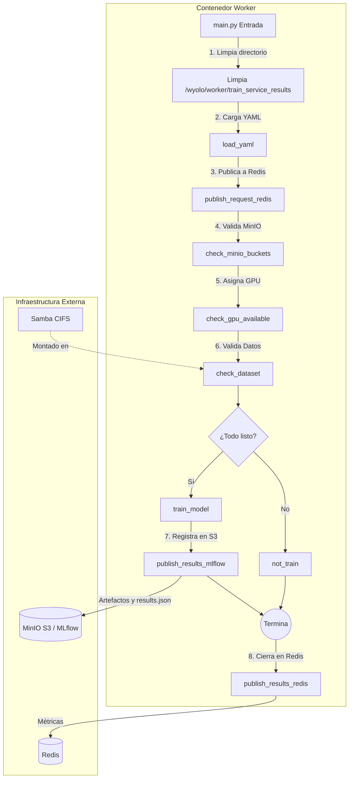

# Worker Executor v2.0 - YOLO Distributed Training Container

Este componente es el **contenedor de ejecución efímero** de alto rendimiento donde se realiza el entrenamiento real de los modelos YOLO (clasificación, detección y segmentación). Es lanzado dinámicamente por el Invoker, procesa las configuraciones a través del motor de pipelines `wpipe` y reporta resultados a MLflow, MinIO y Redis.

---

## 1. 🚶 Diagrama de Flujo del Proceso (Pipeline Stack)

El Executor corre un pipeline secuencial basado en la biblioteca corporativa `wpipe`, asegurando que cada paso intermedio del ciclo de vida se valide y registre.


```mermaid
flowchart TD
    subgraph Contenedor_Worker [Contenedor Worker]
        M[main.py Entrada] -->|1. Limpia directorio| C[Limpia /wyolo/worker/train_service_results]
        C -->|2. Carga YAML| L[load_yaml]
        L -->|3. Publica a Redis| PR[publish_request_redis]
        PR -->|4. Valida MinIO| MIN[check_minio_buckets]
        MIN -->|5. Asigna GPU| GPU[check_gpu_available]
        GPU -->|6. Valida Datos| DS[check_dataset]
        
        DS --> Dec{¿Todo listo?}
        Dec -->|Sí| T[train_model]
        Dec -->|No| NT[not_train]
        
        T -->|7. Registra en S3| PML[publish_results_mlflow]
        PML --> End((Termina))
        NT --> End
        End -->|8. Cierra en Redis| RED[publish_results_redis]
    end

    subgraph Host_y_Servicios [Infraestructura Externa]
        SM[Samba CIFS] -.->|Montado en| DS
        RED -->|Métricas| R[(Redis)]
        PML -->|Artefactos y results.json| MINIO[(MinIO S3 / MLflow)]
    end
```

---

## 2. 🛡️ Características Principales de la versión 2.0

* **Soporte Nativo de YOLO26:** Totalmente validado para arquitecturas clásicas y la nueva versión `yolo26` (ej. `yolo26n.pt`, `yolo26n-cls.pt`, `yolo26n-seg.pt`).
* **Aislamiento Absoluto de Experimentos:** El inicio del pipeline realiza una limpieza física rigurosa sobre el volumen del host montado para evitar la filtración de residuos de ejecuciones anteriores.
* **Extracción de Métricas Difusa (Fuzzy Matching):** Mapeo robusto de métricas entre el tipo de tarea y el formato nativo de Ultralytics (por ejemplo, resolución automática de `metrics/mAP50` hacia `metrics/mAP50(B)` para detección o `metrics/mAP50(M)` para segmentación).
* **Test de Conectividad Samba:** El punto de entrada realiza validaciones automáticas de lectura y permisos de escritura en caliente sobre `/wyolo/control_server/...` antes de iniciar tareas para alertar inmediatamente si el montaje de red se encuentra inestable.

---

## 3. 🏗️ Organización de Artefactos en MinIO / S3

Al finalizar exitosamente el entrenamiento, los archivos resultantes se organizan en caliente bajo la siguiente jerarquía estructurada en el bucket S3:

* `results.json` (Archivo JSON en la raíz del Run con la métrica exacta calculada, ej. `{"accuracy": 0.6635}`).
* `model_weights/` (Contiene `best.pt` y `last.pt`).
* `evaluation_metrics/` (Resultados cuantitativos y gráficas como curvas F1, PR, matrices de confusión y CSVs).
* `training_examples/` (Imágenes y batches de entrenamiento de control).
* `validation_examples/` (Predicciones visuales sobre los batches de validación).
* `training_artifacts/` (Copias de los argumentos YAML y configuraciones de ejecución activa).

---

## 4. ⚙️ Plantillas de Configuración

### Archivo de Entrada (`base_config.yaml`)

```yaml
model: "yolo26n.pt"  # o yolo26n-cls.pt, yolo26n-seg.pt
type: "yolo"
train:
  batch: -1
  data: "/examples/Deteksi komponen elektronik.v1i.yolov8/data.yaml"
  epochs: 2
  imgsz: 640
  plots: true
sweeper:
  version: 1
  algorithm: optuna
  direction: maximize
  study_name: "component_detection"
  fitness: "metrics/mAP50"
  tune: false
  sampler: "TPESampler"
  n_trials: 1
  search_space:
    model: [ "choice", "yolov8n.pt" ]
    train:
      imgsz: [ "choice", 416 ]
      lr0: [ "loguniform", 1e-5, 1e-2 ]
extras:
  gpu:
    id: 0
    limit: 0.95
metadata:
  content: "Experimento de detección de componentes electrónicos."
  author: "William Rodriguez"
  documentation: "Modelo entrenado con pesos yolo26."
```

### Archivo de Resultados (`results.json`)

```json
{
  "accuracy": 0.6635
}
```

---

## 5. 🐳 Construcción y Despliegue

Para compilar la imagen localmente e incluir la última pila de ejemplos:

```bash
# Navegar a la base del subproyecto wtrain
cd executor_v2.0/wtrain

# Compilar de forma clásica para evitar conflictos de caché con volúmenes montados
DOCKER_BUILDKIT=0 docker build --no-cache -t wisrovi/train_service:worker_executor_v1.0.0 -f Dockerfile .

# Subir la imagen final a Docker Hub
docker push wisrovi/train_service:worker_executor_v1.0.0
```

---

**William R.** - AI Leader & Solutions Architect
