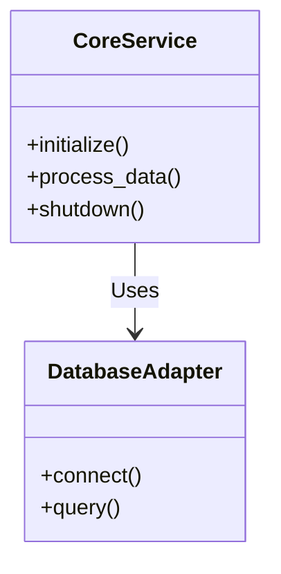

# Architecture & Backend Core

This document outlines the core architecture of the microservice. The service is designed following domain-driven design principles to ensure high cohesion and low coupling.

