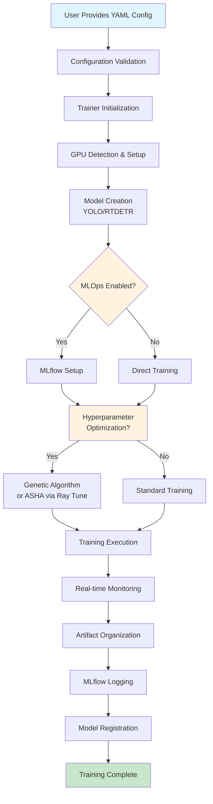
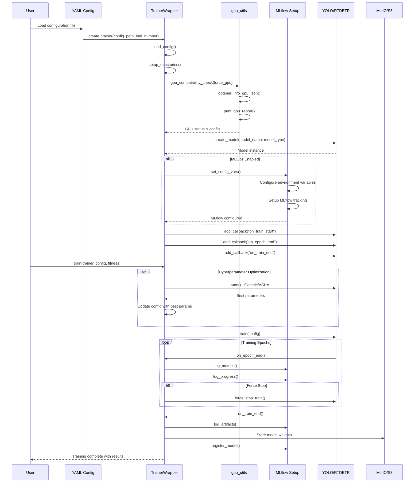
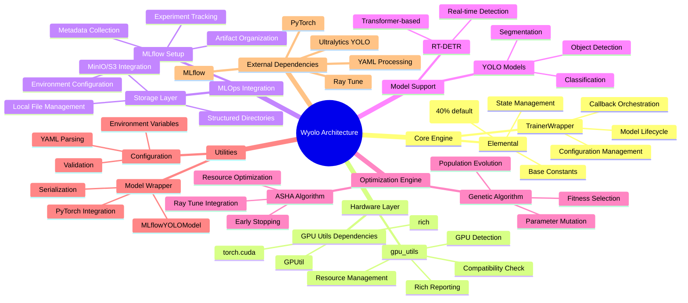
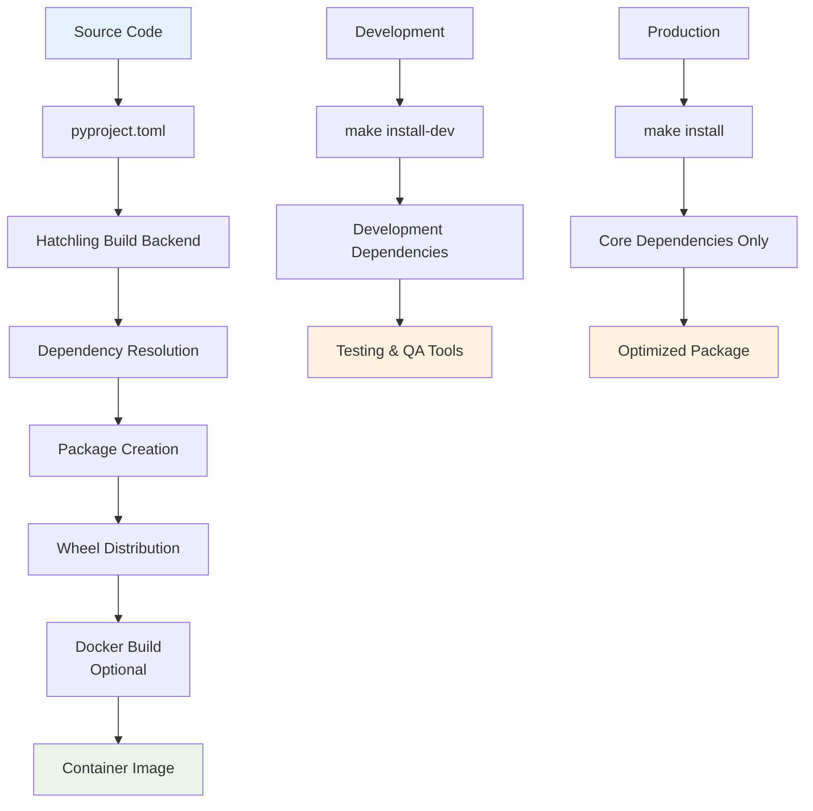
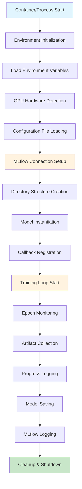

# 🚀 Wyolo - Professional YOLO Training Library

[](https://python.org)
[](LICENSE)
[]()
[]()

> **Wyolo** is a professional YOLO training library with comprehensive MLOps integration, designed for production-grade computer vision projects.


---

## 📋 Project Overview

Wyolo is a sophisticated Python library that streamlines the training of YOLO (You Only Look Once) models for computer vision tasks including **object detection**, **image classification**, and **semantic segmentation**. Built on top of Ultralytics YOLO, it provides enterprise-grade features including:

- **MLOps Integration** with MLflow experiment tracking
- **GPU Optimization** with intelligent resource management
- **Hyperparameter Tuning** using genetic algorithms and ASHA
- **Container-Ready** architecture for cloud deployment
- **Comprehensive Logging** and artifact management

The library is designed for data scientists, ML engineers, and researchers who need a robust, scalable solution for training YOLO models in production environments.

---

## 🚶 Diagram Walkthrough (High-Level Process Flow)



---

## 🗺️ System Workflow (Detailed Sequence Diagram)



---

## 🏗️ Architecture Components



---

## ⚙️ Container Lifecycle

### Build Process



**Build Steps:**
1. **Source Preparation**: Clean repository with proper structure
2. **Dependency Resolution**: pyproject.toml defines all dependencies
3. **Package Build**: Hatchling creates wheel distribution
4. **Docker Build** (Optional): Container creation for deployment
5. **Quality Assurance**: Testing, linting, type checking via Makefile

### Runtime Process



**Runtime Steps:**
1. **Environment Setup**: Load all environment variables and paths
2. **Hardware Detection**: GPU availability and compatibility checks
3. **Configuration Loading**: Parse and validate YAML configuration
4. **MLOps Connection**: Establish MLflow and storage connections
5. **Directory Creation**: Set up organized artifact directories
6. **Model Loading**: Instantiate YOLO/RT-DETR model with weights
7. **Training Execution**: Main training loop with monitoring
8. **Artifact Management**: Organize and store training results
9. **Cleanup**: Proper resource cleanup and shutdown

---

## 📂 File-by-File Guide

| File/Directory | Purpose & Content |
|---------------|-------------------|
| **`src/wyolo/__init__.py`** | Main package entry point exposing `create_trainer` and `train` functions |
| **`src/wyolo/trainer/trainer_wrapper.py`** | Core orchestration engine managing training lifecycle and MLOps integration |
| **`src/wyolo/trainer/utils/mlflow_setup.py`** | MLOps integration handling MLflow configuration, artifact organization, and metadata collection |
| **`src/wyolo/trainer/gpu_utils.py`** | Hardware management for GPU detection, compatibility checking, and resource allocation |
| **`src/wyolo/trainer/cte/elemental.py`** | Base constants and state management for the trainer system |
| **`src/wyolo/trainer/dto/model_wrapper.py`** | MLflow model wrapper for PyTorch model serialization and registration |
| **`datasets_config_examples/`** | Ready-to-use YAML configuration templates for different computer vision tasks |
| **`datasets_config_examples/clasification/`** | Classification training configuration with dataset and model parameters |
| **`datasets_config_examples/detection/`** | Object detection training configuration with YOLO-specific settings |
| **`datasets_config_examples/segmentation/`** | Semantic segmentation training configuration with mask annotation support |
| **`pyproject.toml`** | Modern Python package configuration defining dependencies, build system, and metadata |
| **`Makefile`** | Development workflow automation for installation, testing, building, and deployment |
| **`LICENSE`** | MIT license file governing the use and distribution of the software |
| **`README.md`** | Comprehensive project documentation with installation, usage, and architectural guides |

---

---

## ✨ Key Features

### 🎯 **Multi-Task Support**
- **Object Detection**: Train YOLO models for bounding box detection
- **Image Classification**: Support for classification tasks with YOLO-CLS
- **Semantic Segmentation**: Train segmentation models with YOLO-SEG
- **RT-DETR Support**: Real-time DETR transformer models

### 🚀 **Advanced Training Capabilities**
- **Auto-Batch Sizing**: Intelligent batch size optimization based on GPU memory
- **GPU Management**: Automatic GPU detection and resource allocation
- **Mixed Precision Training**: Optimized for modern GPU architectures
- **Early Stopping**: Configurable stopping criteria and callbacks

### 🔧 **MLOps Integration**
- **MLflow Tracking**: Complete experiment logging and versioning
- **MinIO/S3 Storage**: Scalable artifact storage integration
- **DVC Support**: Data version control integration (planned)
- **Model Registry**: Automatic model registration and versioning

### 🧬 **Hyperparameter Optimization**
- **Genetic Algorithms**: Population-based hyperparameter search
- **ASHA Algorithm**: Asynchronous Successive Halving for efficient tuning
- **Ray Tune Integration**: Distributed hyperparameter optimization
- **Custom Search Spaces**: Flexible parameter configuration

### 📊 **Monitoring & Visualization**
- **Real-time Progress**: Live training progress monitoring
- **GPU Metrics**: Hardware utilization tracking
- **Artifact Organization**: Automatic categorization of training outputs
- **Rich Console Output**: Beautiful terminal displays with rich formatting

---

## 🛠️ Getting Started

### Prerequisites

- Python 3.8 or higher
- CUDA-compatible GPU (optional but recommended)
- MLflow server (for experiment tracking)
- MinIO/S3 storage (for artifact storage)

### Installation

#### Standard Installation
```bash
pip install wyolo
```

#### Development Installation
```bash
git clone https://github.com/wisrovi/wyoloservice2_worker.git
cd wyoloservice2_worker
make install-dev
```

#### Full Installation (with all dependencies)
```bash
make install-all
```

### Quick Start

```python
from wyolo import create_trainer, train

# Create trainer with configuration
trainer, config = create_trainer(
    config_path="examples/detection_config.yaml",
    trial_number=1
)

# Start training
final_result = train(
    trainer=trainer,
    request_config=config,
    fitness="metrics/mAP50(M)"
)

print(f"Training completed with result: {final_result}")
```

### CLI Usage

```bash
# Train a model directly
wyolo-train --config examples/detection_config.yaml

# Check GPU availability
make check-gpu

# Verify MLflow setup
make check-mlflow
```

---

## 📁 File Structure

```
wyolo/
├── src/
│   └── wyolo/
│       ├── __init__.py                 # Main package entry point
│       └── trainer/
│           ├── trainer_wrapper.py      # Core training orchestration
│           ├── gpu_utils.py           # GPU management utilities
│           ├── dto/
│           │   └── model_wrapper.py   # MLflow model wrapper
│           ├── cte/
│           │   └── elemental.py       # Base constants and utilities
│           └── utils/
│               └── mlflow_setup.py    # MLflow integration setup
├── datasets_config_examples/          # Example configurations
│   ├── classification/
│   │   └── config_train.yaml         # Classification config
│   ├── detection/
│   │   └── config_train.yaml         # Detection config
│   └── segmentation/
│       └── config_train.yaml         # Segmentation config
├── pyproject.toml                     # Package configuration
├── Makefile                          # Development utilities
├── LICENSE                           # MIT License
└── README.md                         # This file
```

### Key Directory Functions

- **`src/wyolo/trainer/`**: Core training orchestration and utilities
- **`datasets_config_examples/`**: Ready-to-use configuration templates
- **`pyproject.toml`**: Package metadata, dependencies, and build configuration
- **`Makefile`**: Development workflow automation

---

## ⚙️ Configuration & Setup

### Environment Variables

Configure these environment variables for optimal performance:

```bash
# GPU Usage Control
export MAX_GPU=80  # Maximum GPU utilization percentage (0-100)

# MLflow Configuration
export MLFLOW_TRACKING_URI="http://localhost:5000"
export MLFLOW_S3_ENDPOINT_URL="http://localhost:9000"
export AWS_ACCESS_KEY_ID="your-minio-access-key"
export AWS_SECRET_ACCESS_KEY="your-minio-secret-key"

# Worker Metadata (optional)
export WORKER_HOST="hostname"
export WORKER_OS="linux"
export WORKER_GPU_COUNT="1"
```

### Configuration File Structure

All training configurations use YAML format. Key sections:

#### Basic Configuration
```yaml
model: "yolov8n.pt"        # Pre-trained model to start from
type: "yolo"               # Model type: yolo, rtdetr

train:
  batch: -1                # Auto-batch size (-1 for automatic)
  data: "/path/to/dataset" # Dataset path
  epochs: 100              # Number of training epochs
  imgsz: 640              # Input image size
```

#### MLOps Configuration
```yaml
minio:
  MINIO_ENDPOINT: "http://localhost:9000"
  MINIO_ID: "access-key"
  MINIO_SECRET_KEY: "secret-key"

mlflow:
  MLFLOW_TRACKING_URI: "http://localhost:5000"

sweeper:
  study_name: "my_experiment"
  version: 1
  fitness: "metrics/mAP50(M)"
```

#### Hyperparameter Tuning
```yaml
genetic:
  activate: true
  generations: 10
  poblation_size: 5
  min_epochs_by_ind: 5
  direction: "maximize"
  fitness: "metrics/mAP50(M)"
  use_genetic: false  # Set true for genetic, false for ASHA
```

### Dataset Configuration

#### Classification Dataset
```yaml
train:
  data: "/path/to/classification/dataset"
  # Dataset should follow YOLO classification format:
  # dataset/
  # ├── train/
  # │   ├── class1/
  # │   └── class2/
  # └── val/
  #     ├── class1/
  #     └── class2/
```

#### Detection Dataset
```yaml
train:
  data: "/path/to/dataset/data.yaml"
  # data.yaml should contain:
  # train: /path/to/train/images
  # val: /path/to/val/images
  # nc: number_of_classes
  # names: [class1, class2, ...]
```

#### Segmentation Dataset
```yaml
train:
  data: "/path/to/segmentation/data.yaml"
  # Similar to detection, but with mask annotations
```

---

## 💡 Usage Examples

### Basic Object Detection Training

```python
from wyolo import create_trainer, train

# Load configuration
config_path = "datasets_config_examples/detection/config_train.yaml"

# Create trainer instance
trainer, config = create_trainer(
    config_path=config_path,
    trial_number=1
)

# Execute training
result = train(
    trainer=trainer,
    request_config=config,
    fitness="metrics/mAP50(M)"
)

print(f"Training completed! Final mAP50: {result}")
```

### Image Classification with Genetic Optimization

```python
from wyolo import create_trainer, train

# Configuration with genetic tuning
config_path = "classification_config_with_genetics.yaml"

trainer, config = create_trainer(
    config_path=config_path,
    trial_number=1
)

# Training with automatic hyperparameter optimization
result = train(
    trainer=trainer,
    request_config=config,
    fitness="metrics/accuracy_top1"
)

print(f"Best accuracy achieved: {result}")
```

### GPU-Optimized Training

```python
import os
from wyolo import create_trainer, train

# Set GPU utilization limit
os.environ["MAX_GPU"] = "75"  # Use 75% of GPU memory

trainer, config = create_trainer(
    config_path="gpu_optimized_config.yaml",
    trial_number=1
)

# Force GPU usage (will exit if GPU unavailable)
config["extras"]["force_gpu"] = True

result = train(
    trainer=trainer,
    request_config=config,
    fitness="metrics/mAP50(M)"
)
```

### MLflow Integration Example

```python
from wyolo import create_trainer, train

# Configuration with full MLOps setup
config_path = "mlops_enabled_config.yaml"

trainer, config = create_trainer(
    config_path=config_path,
    trial_number=1
)

# Training with automatic MLflow logging
result = train(
    trainer=trainer,
    request_config=config,
    fitness="metrics/mAP50(B)"
)

# Results are automatically logged to MLflow:
# - Model artifacts
# - Training metrics
# - Hardware information
# - Configuration parameters
```

---

## 📊 System Workflow Diagram

```
┌─────────────────────┐
│   Configuration     │
│   (YAML Config)      │
└─────────┬───────────┘
          │
          ▼
┌─────────────────────┐     ┌──────────────────┐
│  Trainer Wrapper    │────▶│  GPU Utils       │
│  - Load Config      │     │  - Check GPU     │
│  - Create Model     │     │  - Set Memory    │
│  - Setup Callbacks  │     └──────────────────┘
└─────────┬───────────┘
          │
          ▼
┌─────────────────────┐     ┌──────────────────┐
│  MLflow Setup       │────▶│  Model Training   │
│  - Configure Env    │     │  - YOLO Train    │
│  - Set Tags         │     │  - Callbacks     │
│  - Log Artifacts    │     │  - Monitor       │
└─────────┬───────────┘     └──────────────────┘
          │
          ▼
┌─────────────────────┐     ┌──────────────────┐
│  Hyperparameter     │────▶│  Results Storage │
│  Optimization       │     │  - MLflow        │
│  - Genetic/ASHA     │     │  - MinIO/S3      │
│  - Ray Tune         │     │  - Local Files   │
└─────────────────────┘     └──────────────────┘
```

---

## 🔄 Diagram Walkthrough

### 1. **Configuration Phase**
- User provides YAML configuration file
- System validates configuration parameters
- Sets up environment variables and paths

### 2. **GPU Detection & Setup**
- `gpu_utils.py` performs hardware detection
- Configures CUDA and GPU memory allocation
- Sets batch size based on available memory

### 3. **Trainer Initialization**
- `TrainerWrapper` creates YOLO/RT-DETR model
- Configures MLflow integration if enabled
- Sets up training callbacks and monitoring

### 4. **Training Execution**
- Executes training with specified parameters
- Real-time monitoring and logging
- Handles early stopping and force termination

### 5. **Hyperparameter Optimization** (Optional)
- Genetic algorithm or ASHA optimization
- Ray Tune integration for distributed tuning
- Automatic best parameter selection

### 6. **Results Management**
- Organizes artifacts into structured directories
- Logs metrics, models, and metadata to MLflow
- Stores large files in MinIO/S3 storage

### 7. **Model Registration**
- Automatically registers trained models
- Version control and metadata tracking
- Ready for deployment pipelines

---

## 🧪 Development & Testing

### Running Tests
```bash
# Run all tests with coverage
make test

# Run fast tests only
make test-fast

# Run specific test file
pytest tests/test_trainer.py -v
```

### Code Quality
```bash
# Format code
make format

# Check formatting
make format-check

# Run linting
make lint

# Run all quality checks
make check
```

### Development Setup
```bash
# Complete development environment
make dev-setup

# Start development environment
make start

# Run example
make run-example
```

---

## 🤝 Contributing

We welcome contributions! Please follow our development guidelines:

1. Fork the repository
2. Create a feature branch (`git checkout -b feature/amazing-feature`)
3. Make your changes with proper tests
4. Ensure all quality checks pass (`make check`)
5. Commit your changes (`git commit -m 'Add amazing feature'`)
6. Push to the branch (`git push origin feature/amazing-feature`)
7. Open a Pull Request

### Code Style
- Use Black for code formatting
- Follow PEP 8 guidelines
- Add type hints for all functions
- Include docstrings for public methods

---

## 📄 License

This project is licensed under the MIT License - see the [LICENSE](LICENSE) file for details.

---

## 🙋‍♂️ Support

- **Documentation**: [https://wyolo.readthedocs.io/](https://wyolo.readthedocs.io/)
- **Issues**: [GitHub Issues](https://github.com/wisrovi/wyoloservice2_worker/issues)
- **Discussions**: [GitHub Discussions](https://github.com/wisrovi/wyoloservice2_worker/discussions)
- **Email**: wisrovi.rodriguez@gmail.com

---

## 🌟 Acknowledgments

- **Ultralytics**: For the amazing YOLO implementation
- **MLflow**: For experiment tracking infrastructure
- **Ray Tune**: For hyperparameter optimization
- **Rich**: For beautiful terminal output

---

## 📈 Roadmap

- [ ] **DVC Integration**: Complete data version control support
- [ ] **Web Dashboard**: Training monitoring interface
- [ ] **Cloud Deployments**: AWS, GCP, Azure deployment templates
- [ ] **Model Serving**: Integrated model serving capabilities
- [ ] **Multi-GPU Support**: Distributed training across multiple GPUs
- [ ] **Advanced Augmentations**: Enhanced data augmentation pipeline

---

**Built with ❤️ by [William Steve Rodriguez Villamizar](mailto:wisrovi.rodriguez@gmail.com)**